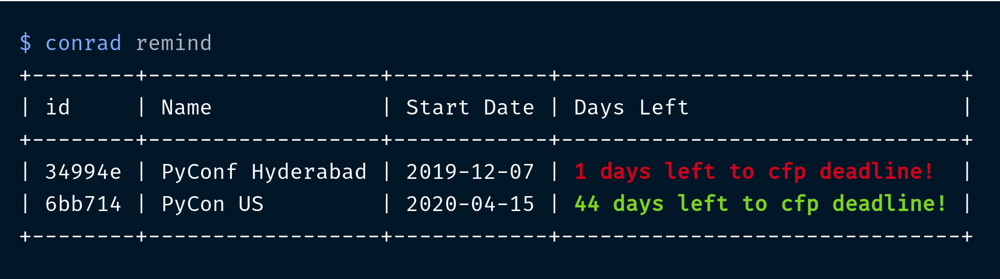
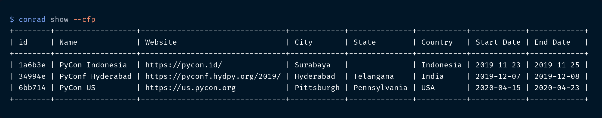
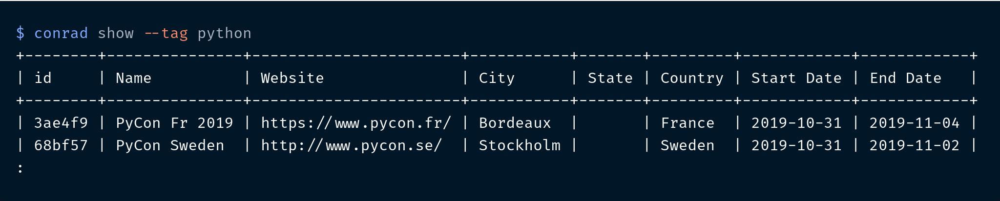
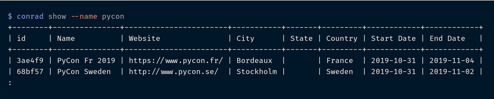
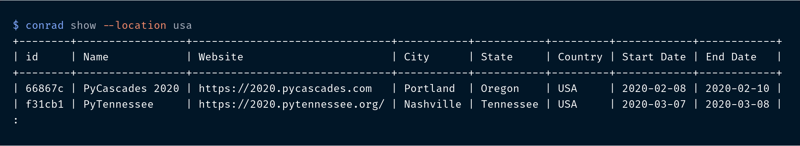
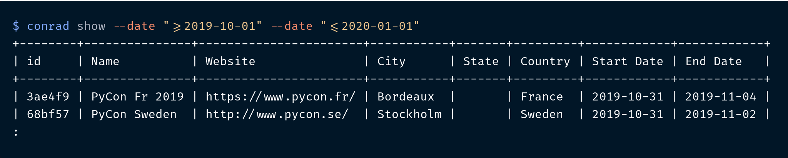
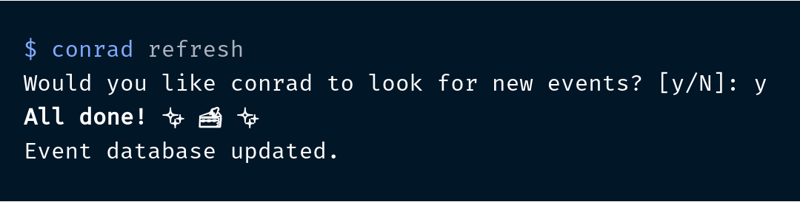

.. conference-radar documentation master file, created by
   sphinx-quickstart on Tue Oct 29 12:04:29 2019.
   You can adapt this file completely to your liking, but it should at least
   contain the root `toctree` directive.

conrad — Conference Radar
=========================

.. image:: https://github.com/vinayak-mehta/conrad/workflows/Get%20events/badge.svg
    :target: https://github.com/vinayak-mehta/conrad/actions
    :alt: Workflow Status

.. image:: https://readthedocs.org/projects/conference-radar/badge/?version=latest
    :target: https://conference-radar.readthedocs.io/en/latest/
    :alt: Documentation Status

.. image:: https://img.shields.io/pypi/v/conference-radar.svg
    :target: https://pypi.org/project/conference-radar/

.. image:: https://img.shields.io/pypi/pyversions/conference-radar.svg
    :target: https://pypi.org/project/conference-radar/

.. image:: https://img.shields.io/badge/code%20style-black-000000.svg
    :target: https://github.com/ambv/black

``conrad`` helps you track conferences and meetups on your terminal!

---

Here's how it works::

    $ conrad show

.. image:: _static/show.png

Why conrad?
-----------

- 📅 Never miss CFP deadlines again. ``conrad remind`` can remind you every time you open a terminal!
- 📊 Query and explore events using tags, names, locations, and dates. ``conrad show --cfp`` will tell you about events where the CFP is open!
- 🤖 Crawlers update events twice a week! (Monday and Thursday at 00:00 UTC)

Installation
------------

You can simply use pip to install ``conrad``::

    $ pip install conference-radar

Features
--------

Continuous updates
^^^^^^^^^^^^^^^^^^

The event list is maintained in ``data/events.json``. This list is continuously updated by the available ``crawlers`` using GitHub Actions.

Sources:

- https://pydata.org/event-schedule
- https://github.com/ildoc/awesome-italy-events
- https://github.com/python-organizers/conferences
- https://wiki.python.org/moin/PythonEventsCalendar
- http://papercall.io (soon)

Set reminders
^^^^^^^^^^^^^

You can set CFP reminders so that you never miss a deadline! The color changes based on event proximity::

    $ conrad remind -i 6bb714
    $ conrad remind

.. note:: Add ``conrad remind`` to your shell startup file so that you get a reminder every time you open a new terminal!

Query and explore
^^^^^^^^^^^^^^^^^

You can query and explore the event database using various filters.

Look at events which have an open call for proposals (CFP)::

    $ conrad show --cfp

Look at conferences using a tag::

    $ conrad show --tag python

Look at conferences using a name::

    $ conrad show --name pycon

Look at conferences in a city, state or country::

    $ conrad show --location usa

Look at conferences based on when they're happening::

    $ conrad show --date ">= 2019-10-01" --date "<= 2020-01-01"

Refresh event database
^^^^^^^^^^^^^^^^^^^^^^

You can get the latest events using::

    $ conrad refresh

Contributing
------------

The `Contributor's Guide <https://github.com/vinayak-mehta/conrad/blob/master/CONTRIBUTING.md>`_ has detailed information about guidelines around contributions. You can add new crawlers and events to ``conrad``:

.. toctree::
   :maxdepth: 2

   dev/adding-crawlers
   dev/adding-events

Versioning
----------

``conrad`` uses `Semantic Versioning <https://semver.org/>`_. For the available versions, see the tags on the GitHub repository.

License
-------

This project is licensed under the Apache License, see the `LICENSE <https://github.com/vinayak-mehta/conrad/blob/master/LICENSE>`_ file for details.
